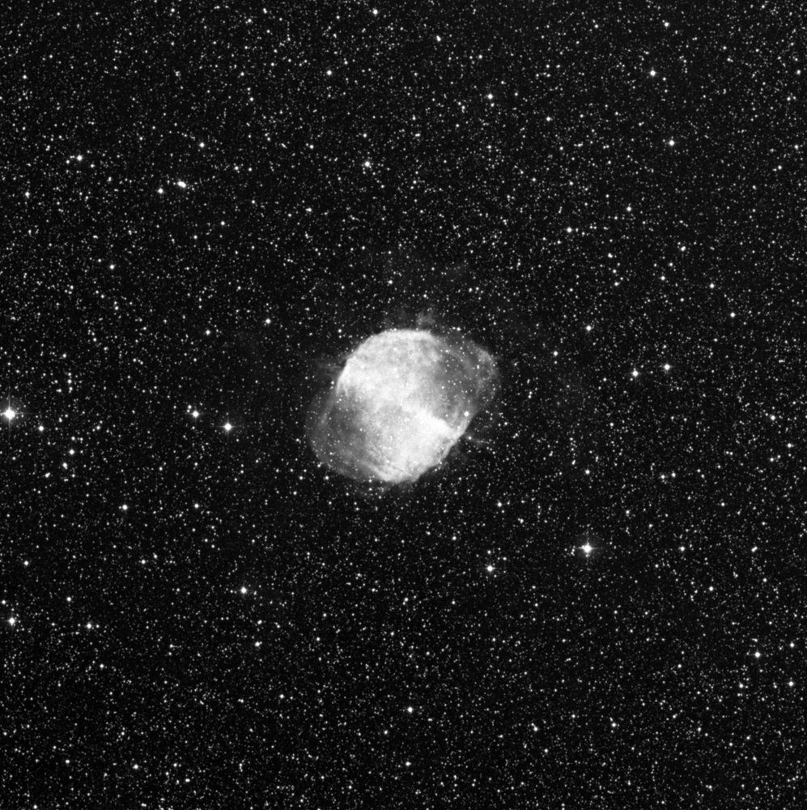

# SkySurveyFetcher
从The STScI Digitized Sky Survey系统下载天体图片的Python脚本，Python script for fetching celestial images from the STScI Digitized Sky Survey

现在桌面上有一个CSV文件，名称为targets_dss，包含四列数据，分别是天体ID、RA坐标（HHMMSS格式）、DEC（符号DDMMSS）和最大尺寸，如下所示
ID	RA	DEC	Major axis size
M1	05h34m32s	+22°00′52″	8
M2	21h33m27s	-00°49′24″	16

每个天体目标的信息，拼接到下面的链接里
https://archive.stsci.edu/cgi-bin/dss_search?v=poss2ukstu_red&r=HH+MM+SS&d=DD+MM+SS&e=J2000&h=Major&w=Major&f=gif&c=none&fov=NONE&v3=
要求1：要留意DEC的符号也要带进去:
要求2：如果Major axis size大于30，则Major极为120,否则乘以四倍，比如Major axis size为8，则Major记录32，Major axis size为180，则Major记录120

比如M1
https://archive.stsci.edu/cgi-bin/dss_search?v=poss2ukstu_red&r=05+34+32&d=+22+00+52&e=J2000&h=32&w=32&f=gif&c=none&fov=NONE&v3=

https://archive.stsci.edu/cgi-bin/dss_search?v=poss2ukstu_red&r=21+33+27&d=-00+49+24&e=J2000&h=64&w=64&f=gif&c=none&fov=NONE&v3=

为了降低服务器压力，每5秒钟去访问一次，它会从dss_search服务获取到一个GIF图片，下载到本地，取天体ID作为文件的名字，比如M1.gif、M2.gif

下载文件自动缩小尺寸，最长边1000px。